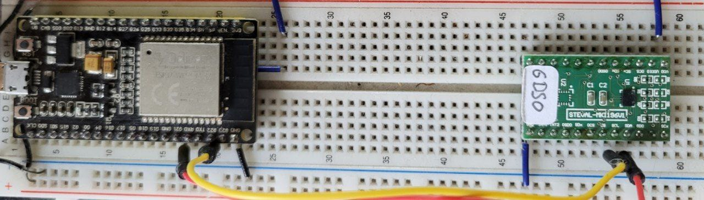

# Arduino I2C-UART Bridge

A simple Arduino-based bridge that allows controlling I2C devices via UART/Serial commands. This project enables easy scripting and automation of I2C communication from a host computer.

## Example


Connect an ST LSM6DSO device, and assert its device id.

``` bash
$ cat lsm6dso_who_am_I.txt
a 6b
wr f 1
EXPECT 6.
$ python run_commands.py -p /dev/ttyUSB0 lsm6dso_who_am_I.txt
Connected to I2C bridge on /dev/ttyUSB0
Starting execution of commands from: lsm6dso_who_am_I.txt
---> a 6b
---> wr f 1
<--- 6C
---> EXPECT "6." ✓
```

## Features

- Write bytes to I2C devices
- Read bytes from I2C devices  
- Serial command interface for easy scripting

## Hardware Requirements

Runs on Arduino Leonardo, Uno, or ESP32

## Wiring

Connect your I2C device to the Arduino:

| Arduino Pin | I2C Signal | Notes |
|-------------|------------|-------|
| SDA | SDA | Data line |
| SCL | SCL | Clock line |
| 5V or 3.3V | VCC | Power (check device requirements) |
| GND | GND | Ground |

**Pin Assignments by Board:**
- **Arduino Uno/Nano**: SDA = A4, SCL = A5
- **Arduino Leonardo/Micro**: SDA = 2, SCL = 3  
- **ESP32**: SDA = 21, SCL = 22 (default)

## Installation & Deployment

### 1. Install PlatformIO
```bash
pip install platformio
```

### 2. Build and Upload
```bash
# For Arduino Leonardo
pio run -e leonardo -t upload

# For ESP32
pio run -e esp32dev -t upload
```

### 3. Install Python Dependencies (for scripting)
```bash
pip install pyserial
```

## Usage

### Serial Commands

Connect to the Arduino via serial terminal (9600 baud, e.g. `pio device monitor -p /dev/ttyUSB0 -b 9600`) and use these commands:

| Command | Description | Example |
|---------|-------------|---------|
| `a XX` | Set I2C address | `a 48` (sets address to 0x48) |
| `w XX XX XX...` | Write hex bytes | `w 12 34 56` (writes 0x12, 0x34, 0x56) |
| `r XX` | Read XX bytes | `r 04` (reads 4 bytes) |
| `wr XX XX... COUNT` | Write then read | `wr 12 34 02` (write 0x12,0x34 then read 2 bytes) |

### Python Scripting

Use the included Python script to execute commands from a file:

```bash
# Basic usage
python3 run_commands.py commands.txt

# Specify different serial port
python3 run_commands.py commands.txt -p /dev/ttyUSB0

# Enable verbose output
python3 run_commands.py commands.txt -v
```

### Command File Format
The command file contains exactly the lines that are to be sent to the device. Use # as a comment sign.

```bash
# commands.txt
# This is a comment
a 48          # Set I2C address to 0x48
w 01 FF       # Write 0x01, 0xFF to device  
r 04          # Read 4 bytes
EXPECT "12 34 56 78"    # Validate exact response
wr 10 02      # Write 0x10, read 2 bytes
EXPECT "[A-F0-9]{2} [A-F0-9]{2}"  # Validate hex pattern
```

#### EXPECT Command (Python Script Only)

The `EXPECT` command is a host-only feature that validates Arduino responses using regex patterns:

**Syntax:** `EXPECT "pattern"` or `EXPECT pattern`

**Examples:**
- `EXPECT "12 34 56 78"` - Exact match
- `EXPECT "^[A-F0-9 ]+$"` - Any hex output
- `EXPECT "[A-F0-9]{2}"` - Contains 2-digit hex
- `EXPECT "FF$"` - Ends with "FF"


